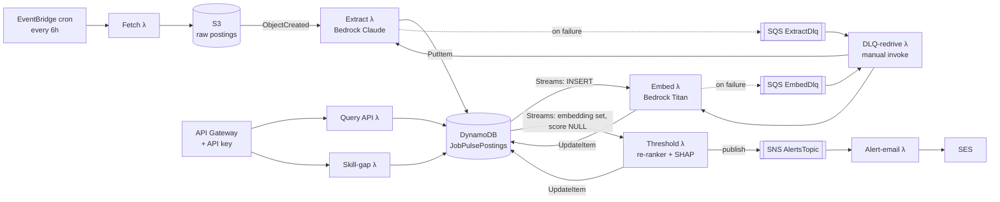

# JobPulse

**A fully serverless, event-driven pipeline that ingests job postings, extracts
structured fields with an LLM, scores each posting against a candidate profile with an
embedding + trained re-ranker model, and alerts on high-fit postings — with SQS
dead-letter retry, SHAP explainability, and skill-gap analysis layered on top.**

Built as a general-purpose job-market intelligence tool (a pluggable candidate profile,
not a hardcoded personal script) and evaluated the way a production ML system would be:
against a held-out test set, with a documented baseline comparison, not just "I called an
LLM and it worked."

## Architecture



A second, fully independent on-demand path (`API Gateway → Lambda → DynamoDB`) serves
ranked, filterable results and the skill-gap report without touching the ingestion side
at all. CloudWatch (structured logs, EMF custom metrics, error-rate/duration/DLQ-depth
alarms, a dashboard) and X-Ray tracing cover every Lambda; GitHub Actions runs lint,
type-checks, the full test suite, and a two-account (staging → manually-approved
production) CDK deploy on every push.

## Core capabilities (spec §1–§2)

- Scheduled ingestion from a job-board API, with S3 as an immutable raw-data audit trail
- LLM structured extraction (title, company, comp range, seniority, required skills,
  remote/visa status) via Amazon Bedrock (Claude)
- Embedding-based fit scoring (Bedrock Titan Embeddings + cosine similarity) re-ranked by
  a trained classifier on engineered features
- Automated SNS → SES email alerts for postings that clear a fit threshold
- A persisted, queryable, filterable history of postings and scores behind API Gateway

## Advanced features (spec §5 — 3 of 8, by design)

Rather than build all eight suggested extensions shallowly, three were built with real
depth instead:

| Feature | Spec § | What it actually does |
|---|---|---|
| **SQS DLQ + retry** | 5.1 | Two *different* DLQ mechanisms for two *different* trigger types (async Lambda Destinations for S3-triggered extraction; event-source-mapping DLQ for DynamoDB-Streams-triggered embedding) — plus a redrive Lambda that replays each correctly, not uniformly. |
| **SHAP explainability** | 5.2 | Exact closed-form SHAP values for the linear re-ranker (`weight_i * (x_i - baseline_i)`), computed in stdlib Python with zero `shap`/numpy at Lambda runtime, verified against the real `shap.LinearExplainer` in a dedicated test. |
| **Skill-gap analysis** | 5.2 | A dedicated Lambda + API route that aggregates `required_skills` across postings the candidate scored below the fit threshold on, ranked by how often each missing skill appears — a learning recommendation, not a match score. |

`PLAN.md` has the full phase-by-phase build log and a spec-requirement → phase coverage
map; each phase's local interview-prep notes go deeper on the specific engineering
tradeoffs (packaging constraints, self-trigger-safe DynamoDB Streams filters, IAM
least-privilege, testing strategy) than this README does.

## The match-scoring model — evaluated, not just built

Both a logistic regression and an XGBoost model are trained and compared offline
(`ml/train.py`) against a keyword/BM25 baseline and an embedding-similarity-only
baseline (`ml/baselines.py`, `ml/evaluate.py`); only the logistic regression is deployed
(a fitted linear model's decision function is a few lines of stdlib Python — no
scikit-learn/xgboost, which together run ~345MB unzipped, well past Lambda's 250MB
layer limit).

**Measured results** (`ml/evaluation_report.md`, regenerate via `python -m ml.evaluate`):

| Approach | Precision@10 | Recall@10 | ROC-AUC |
|---|---|---|---|
| Keyword / BM25 | 0.400 | 0.154 | 0.540 |
| Embedding similarity only | 0.700 | 0.269 | 0.689 |
| Embedding + re-ranker | 0.900 | 0.346 | 0.749 |

Embedding + re-ranker vs. embedding-only: **+0.060 ROC-AUC**.

> **These numbers are from a synthetic demo dataset** (`ml/synthetic_data.py`), not a
> manually-labeled real posting set — spec §3.2 calls for hand-labeling 150–300 *real*
> postings against your *own* resume, which requires a human and real scraped data
> neither of which can be fabricated here. The synthetic dataset exists so the
> training/evaluation pipeline itself — feature engineering, model comparison, metric
> computation, baseline delta — is provably correct end-to-end. **Don't quote the table
> above as a resume bullet.** Run `python -m ml.generate_synthetic_dataset` → hand-relabel
> `ml/data/labels.csv` against your own resume and real scraped postings → `python -m
> ml.train && python -m ml.evaluate` to get real numbers, then use the spec's suggested
> framing: *"Built an embedding-based job-fit scoring model, evaluated on a
> manually-labeled set of N postings, achieving X% Precision@10 (vs. Y% for keyword
> matching), and deployed it in a serverless pipeline that autonomously screens N
> postings/day."*

## Tech stack

Lambda (Python 3.12) · EventBridge · S3 · DynamoDB (+ Streams) · Bedrock (Claude +
Titan Embeddings) · SNS · SES · SQS (DLQ) · API Gateway · CloudWatch (Logs/Metrics/
Alarms/Dashboard) + X-Ray · scikit-learn / XGBoost / SHAP (offline) · AWS CDK (Python) ·
GitHub Actions (OIDC, staging + manually-gated production)

## Repo layout

```
infra/            AWS CDK app — infra/jobpulse_infra/jobpulse_stack.py is the one stack
                  every phase adds to. Separate venv (infra/.venv) from the app code.
lambdas/          One folder per Lambda: fetch, extract, embed, threshold, query_api,
                  skill_gap, dlq_redrive, alert_email
common/           Shared pydantic data contracts + DynamoDB item (de)serialization,
                  bundled into every Lambda that needs them as a Lambda layer
ml/               Offline training/eval: synthetic data generation, feature engineering,
                  model training + comparison, evaluation report
tests/            pytest suite mirroring lambdas/ + common/ + ml/ (moto for AWS mocking)
```

## Setup & deploy

Full manual steps (AWS credentials, Bedrock model access, SES sandbox verification,
GitHub OIDC/Environments) are in `SETUP.md`. Quick start:

```bash
# App/ML dependencies
python3 -m venv .venv && source .venv/bin/activate
pip install -r requirements.txt -r requirements-dev.txt
python -m ml.train                 # trains + exports the re-ranker (CDK deploy precondition)

# Infra (separate venv — CDK toolkit deps, deliberately isolated from ml/ deps)
cd infra && python3 -m venv .venv && source .venv/bin/activate
pip install -r requirements.txt -r requirements-dev.txt
cdk bootstrap                      # one-time per AWS account/region
cdk deploy -c senderEmail=you@example.com -c recipientEmail=you@example.com
```

## Testing

```bash
source .venv/bin/activate && python -m pytest -q            # root: lambdas/ + common/ + ml/
cd infra && source .venv/bin/activate && python -m pytest -q  # CDK stack assertions
ruff check . && mypy .                                       # both venvs
```

## Project stats

- **16 build phases** (0–15), each on its own branch/PR with full test coverage before
  merge — `PLAN.md` has the complete log
- **218 tests** (180 app/ML + 38 CDK infrastructure), all passing, no skipped/xfail
- **8 Lambdas**, each with its own `requirements.txt` and IAM role scoped to exactly
  what it does (no `grant_read_data()`/`grant_write_data()` broad grants where a single
  action suffices)
- **16 CloudWatch alarms** (error-rate + duration per pipeline Lambda, plus DLQ depth)
  and a CloudWatch dashboard, entirely defined in CDK
- **1 REST API**, 2 routes (`/` proxy for ranked postings, `/skill-gap` for the learning
  recommendation), 1 API key — verified in the synthesized template that adding the
  second route doesn't fork into a second API
